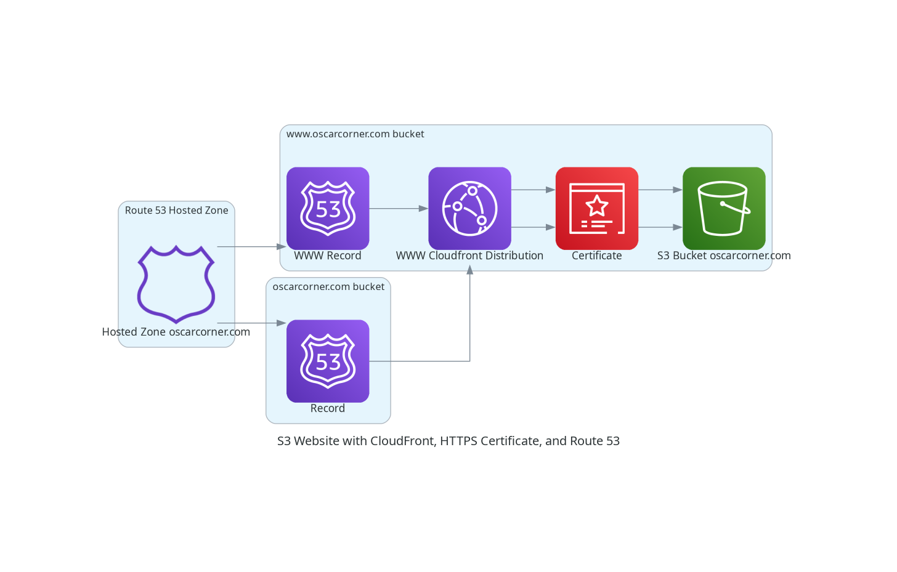

# Moving the website to use the new theme, and AstroJS instead of Hugo.

We have a new look, much cleaner and easier to read in my opinion, there where a couple of things I wasn't happy with the previous site.

And it makes me work a bit on my JS, Html skills, even if I used a theme Astro Cactus.

The changes and the migration was quite easy as still uses md files for the content and they can be easily moved.

The ci, is quite simple for it as we still use s3 + cloudfront for the distribution of it.

Architecure diagram for the hosting of the website:
 
