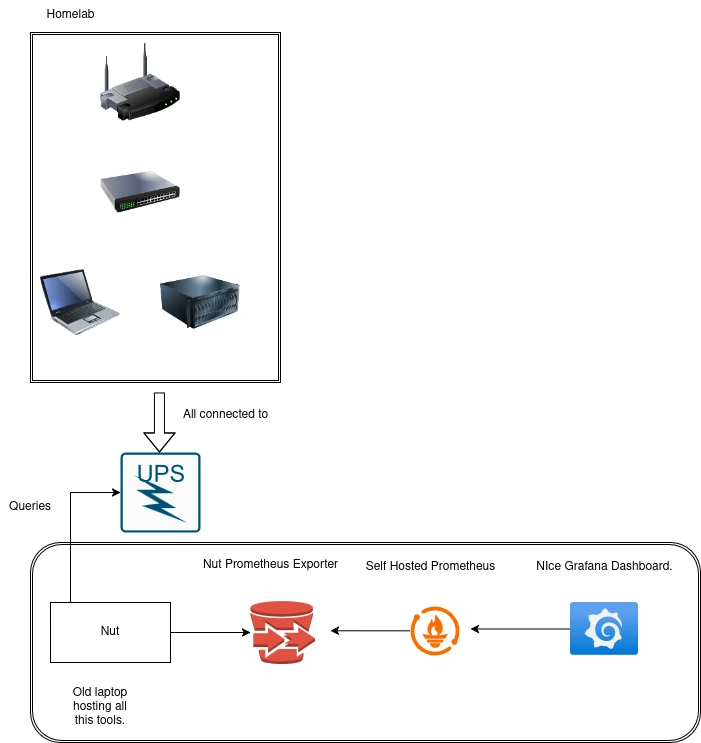

# Tracking homelab power draw using nut tools, prometheus and grafana oss.


I've recently build a homelab, after having wifi issues with the basic router provided by an isp, and getting more space after moving and finally getting a nice oled tv.

So with my new set up consiting of and old laptop, I had lying around, and a nas using true-nas, and a openwrt router and a small 10g switch, I had a burning question with the rising uk energy prices, how much is this thing costing me every month?

Thanks to watching a video of Nut power tools, and having a ups set up for my nas, I was off to tinkering, let's see if I can get some data out of this.

First of all I checkd the model and see if is supported by the nut project. Good news it was! So of to building somethin I was.

## Architecture

Having a quick look that's what we're going to set up.




- In order to set up nut i followed a couple articles:

[First one](https://technotim.live/posts/NUT-server-guide/)
[And](https://www.jeffgeerling.com/blog/2025/nut-on-my-pi-so-my-servers-dont-die)

- Once I had that working I went to search for a prometheus exporter for the tool and good luck there was one ready for me to use (one day I should really build one and underestand it further).

[This is the exproter I ended up using](https://github.com/HON95/prometheus-nut-exporter)

And one bit of prometheus exporting and we had data on to be seen!

Now we need to now how much power we are drawing and how much it costs.

Getting the avg power draw is a query away.

```
((avg_over_time(nut_load[1h]) / 100) * nut_real_power_nominal_watts) * 100
```
I had to do some division as I was not getting in wats but kw so I had to normalize.
Since electricity is billed in kWh, and we get the power in wats first we need to convert from w to kWh.
k
Should be easy enough.
```
kWh = (watts × hrs) ÷ 1,000
```

So now we need to convert the amount we are using to kwh and multiply by how much the electricity company is charging us.

```
(avg_over_time(nut_load[1h])) * on(instance) nut_real_power_nominal_watts  / 1000 * (the kwh price )
```

If you want the code for the set up and hosting of it I have a repo for it.

Where I automate the deploy with ansible for all my systemd jobs, and docker compose files.

[Repo](https://github.com/oscarsjlh/oscar-iac-selfhosted)
